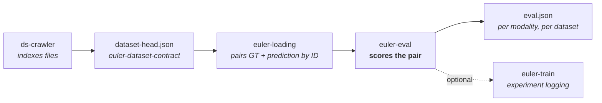

<!-- euler header — shared across the euler packages.
     Per package, change only: the <h1>, the tagline, and the badge URLs. -->
<p align="center">
  
</p>

<h1 align="center">euler-eval</h1>

<p align="center">
  <em>Score depth, RGB, ray and 3D point-map predictions against the same ground truth — from one JSON config.</em>
</p>

<p align="center">
  <a href="https://pypi.org/project/euler-eval/"></a>
  <a href="https://pypi.org/project/euler-eval/"></a>
  <a href="LICENSE"></a>
  <a href="https://github.com/d-rothen/euler-eval/actions/workflows/ci.yml"></a>
</p>

---

Comparing predictions to ground truth is rarely one line of code. The files have
to be paired, the ground truth may be radial where the prediction is planar, the
model may only be correct up to scale, and every modality wants a different
metric set.

euler-eval takes a JSON config naming the ground truth and one or more
prediction datasets, and writes an `eval.json` per modality: files paired by ID,
decoded from dataset metadata rather than convention, aligned when the
prediction is not metric, and scored with the metric set that modality deserves.



It is the consuming end of that pipeline and does none of the earlier steps
itself: a path in the config is a
[euler-loading](https://github.com/d-rothen/euler-loading) path, and how to
decode it — loader, units, radial or planar depth, point-cloud column layout —
is read from the dataset's own index. Metric keys are built with
[euler-metric-naming](https://github.com/d-rothen/euler-metric-naming), so every
result is self-describing to downstream tools.

## Install

```bash
pip install euler-eval                  # core
pip install "euler-eval[fid]"           # + clean-fid RGB FID backend
pip install "euler-eval[logging]"       # + euler-train experiment logging
```

Python 3.9 or newer. CUDA is used automatically when available, and every metric
also runs on CPU.

## Quick start

Describe the ground truth and what to score against it:

```json
{
  "gt": {
    "rgb":   { "path": "/data/gt/rgb" },
    "depth": { "path": "/data/gt/depth" }
  },
  "datasets": [
    {
      "name": "model_a",
      "rgb":   { "path": "/data/model_a/rgb" },
      "depth": { "path": "/data/model_a/depth" }
    }
  ]
}
```

```bash
euler-eval config.json --batch-size 32
```

Ground truth and prediction files are matched by ID rather than by directory
order, so an incomplete prediction set scores the frames it does have instead of
silently comparing the wrong pairs. Results are written next to each prediction
modality:

```json
{
  "depth": {
    "eval": {
      "metric": {
        "standard": {
          "image_mean": { "absrel": 0.081, "rmse": 3.42, "delta1": 0.93 }
        }
      }
    }
  }
}
```

Every path accepts euler-loading's inline selectors, so splits and archives need
no extra plumbing — `"/data/muses.zip:test#scope=rgb"` reads the `test` split
straight out of the archive. Full schema: [Configuration](docs/configuration.md).

## What it evaluates

| Modality | Config key | Scored against | Headline metrics |
|---|---|---|---|
| **Depth** | `depth`, `relative_depth`, `affine_depth` | dense GT depth | `absrel`…`delta3`, PSNR/SSIM/LPIPS/FID/KID, surface-normal consistency, depth-edge F1 |
| **Sparse depth** | `depth` + `gt.sparse_depth` | a LiDAR-style point cloud, projected into the prediction plane | pointwise depth metrics at projected points, plus directed 3D completeness |
| **RGB** | `rgb` | GT RGB | PSNR, SSIM, LPIPS, FID, SCE, edge F1, tail errors, HF energy ratio, depth-binned photometric error; optional NIQE/FADE dehazing metrics |
| **Rays** | `rays` | GT ray direction map | ρ_A (angular-accuracy AUC), angular error, threshold percentages |
| **Points-3D** | `points_3d` | GT point map, or GT depth unprojected on the fly | 3D EPE/RMSE/δ, radial-vs-lateral decomposition, true-3D normals and edge F1, Chamfer / F-score |

A run evaluates whichever modalities are configured on both sides; a depth-only
prediction is a perfectly ordinary run. The full inventory, with the key each
metric is written under, is in [Metrics](docs/metrics.md).

## What you get

| | |
|---|---|
| **ID-based pairing** | GT and prediction frames are matched by file ID and hierarchy, not by filename luck. Calibration and pose files are matched by tree position and shared. |
| **Metadata-driven decoding** | Radial vs planar depth, value ranges, point-cloud column layout and loader choice all come from the dataset index — no per-dataset flags. |
| **Honest spaces** | Relative models are scored `native` *and* `metric` (after scale/shift or a similarity gauge), so a scale failure never reads as a geometry failure. |
| **Benchmark depth bins** | `--benchmark-depth-range MIN MAX` adds near/mid/far bins in square-root depth space, additive to the regular metrics. |
| **Sky masking** | `--mask-sky` drops sky pixels using GT segmentation — from the metrics *and* from the alignment fit. |
| **Per-file + aggregate** | Dataset-level numbers plus per-image metrics in dataset-hierarchy order, in the same file. |
| **Sanity checks** | Results are validated against configurable thresholds; implausible ranges, degenerate inputs and scale mismatches are reported instead of quietly scored. |
| **Structured metric names** | Each result carries a `metricSet` envelope declaring its namespace, axes, units and metric directions. |
| **Composable domains** | `--domain dehazing` supplements the stable core set with prediction-only NIQE and FADE; the registry is ready for additional domains. |
| **euler-train logging** | Optional: register each evaluation in an experiment run with full package provenance. |

## In-training validation

The same depth-metric semantics are available for in-memory predictions, so a
training loop's validation numbers match what the CLI reports later — against
dense *or* sparse ground truth, without writing predictions to disk:

```python
from euler_eval import DepthValidationAggregator, evaluate_sparse_depth_sample

aggregator = DepthValidationAggregator()
for sample in val_dataset:
    result = evaluate_sparse_depth_sample(
        model(sample["rgb"]),        # (H, W) metres
        sample["sparse_depth"],      # (N, C>=3) lidar points
        intrinsics,
        lidar_to_camera,
        alignment="none",            # "affine" for relative depth
    )
    aggregator.update(result)

aggregator.summary()["standard"]["image_mean"]["absrel"]
```

Multi-process runs reduce sufficient statistics rather than averages — see
[In-training validation](docs/validation.md).

## Documentation

| Guide | Covers |
|---|---|
| [Configuration](docs/configuration.md) | The config file, `gt` and `datasets`, paths and selectors, sparse-depth and points-3d ground truth, euler-train logging |
| [CLI reference](docs/cli.md) | Every flag, worked examples, device selection, offline cache warmup |
| [Spaces & alignment](docs/alignment.md) | `native` vs `metric`, depth affine fitting, points-3d gauge alignment, benchmark depth bins |
| [Metrics](docs/metrics.md) | The full metric inventory per modality |
| [Results & output](docs/output.md) | Anatomy of `eval.json`, per-file metrics, the sanity-check report |
| [In-training validation](docs/validation.md) | The programmatic API for scoring in-memory predictions |

Start with [the concepts page](docs/README.md) for how the pieces fit together.

## Development

```bash
git clone https://github.com/d-rothen/euler-eval.git
cd euler-eval
uv sync --extra dev     # or: pip install -e ".[dev]"
uv run pytest
```

See [CONTRIBUTING.md](CONTRIBUTING.md) for the test layout and release process.

## License

[MIT](LICENSE) © Daniel Rothenpieler
